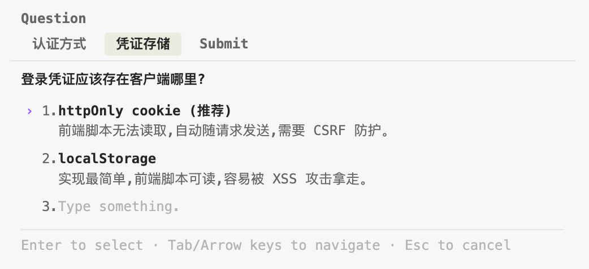

I previously studied the design of Claude Code and built a bare-bones version in Java — open-sourced at [jooj](https://github.com/diaozxin007/jooj). Claude Code's tools are all exquisitely designed, so I want to examine them one by one. Let's learn together.

> Start this series with the [Prerequisite article](../tool-mechanism.md) — it explains what a tool is and how Claude uses them. This article is the first specific tool teardown in the series, structured around the 4-layer skeleton proposed in the prerequisite.

## AskUserQuestion

One of the most commonly seen tools.

### Purpose

AskUserQuestion is Claude Code's built-in **structured questioning tool**. Instead of having Claude output a question string and wait for a reply, it renders the question as an interactive selection panel — the user sees a set of preset options (in card form), not a wall of plain text.

The core problem it solves is "efficient alignment between AI and user":

1. **Lowers user effort** — from "type an answer" to "click an option," drastically shortening response time
2. **Structured input** — Claude receives explicit enum values, no need to parse natural language
3. **Converges ambiguity** — guides users to choose between well-defined options through presets, avoiding vague "you decide" responses
4. **Escape hatch guaranteed** — the system always auto-appends an "Other" option allowing custom text input, preventing "none of these fit and I'm stuck"

### A Concrete Example

Before diving into trigger conditions and technical implementation, let's look at a concrete scenario to feel the difference between "without AskUserQuestion" vs "with AskUserQuestion."

**Scenario**: The user tells Claude **"Add user login to this app."**

This requirement is highly incomplete — authentication method unspecified, credential storage unspecified. Claude can neither guess wildly (the user might have team standards) nor infer from existing code (new feature, no precedent).

#### Anti-pattern: Without AskUserQuestion

Claude can only throw the question back in free-form text, something like:

> "What authentication method would you like? I'd suggest JWT, but you could also use session cookies or OAuth. Also, where should credentials be stored — httpOnly cookie or localStorage?"

The user faces several problems:

1. **High cognitive load** — a wall of text packing 2 decisions + 5 options, requiring the user to parse the questions before answering
2. **High answer cost** — either type out a reply ("JWT + httpOnly") or spend two hours researching "JWT vs session cookies" before coming back
3. **High parsing cost for Claude** — receiving "just JWT, the cookie thing" and having to reverse-engineer which option the user actually picked, possibly getting it wrong
4. **Recommendation buried in text** — Claude says "I'd suggest JWT" but it's mixed in with other options, easily overlooked
5. **No fallback** — if the user wants an approach Claude didn't mention (like passwordless magic links), they either write a whole explanation or get locked into Claude's three choices

**Core pain point**: This plain-text form turns "collaborative alignment" into an expensive natural-language round-trip.

#### How AskUserQuestion Solves This

Claude constructs a call containing **two questions**:

**Question 1** —

**Question 2** —

What the user sees on screen are two cards, each with a short tag at the top ("Auth method" / "Token storage"), followed by 3 or 2 options + an auto-appended "Other." Two clicks and done. Claude receives return values roughly like:

- Question 1 → user selected **JWT (Recommended)**
- Question 2 → user selected **httpOnly cookie (Recommended)**

**Decision time compressed from minutes to seconds**. This is why AskUserQuestion exists — not "letting AI ask questions," but "making every clarification in the collaboration low-cost."

#### Side-by-Side: Each Pain Point Solved

| Anti-pattern pain | AskUserQuestion's fix |
|---|---|
| High cognitive load | Split into 2 independent cards, one decision at a time |
| High answer cost | Click instead of type; trade-offs sit right under each option |
| High parsing cost for Claude | Return value is explicit option text, no NL parsing needed |
| Recommendation buried in text | "(Recommended)" suffix + first position — impossible to miss |
| No fallback | "Other" auto-appended; custom input always available as escape hatch |

This comparison is essentially the raison d'etre for every design point in AskUserQuestion — each one maps to a specific pain point that free-text conversation cannot solve. With this intuition in mind, as you read the trigger conditions, technical implementation, and prompt details below, you'll find that every constraint maps back to one of these specific pain points.

### Trigger Conditions

The tool's official description explicitly states the trigger boundary: **Use only when you are blocked on a decision that genuinely belongs to the user.**

Three scenarios where you **should ask**:

- **Cannot infer from the request** — the requirement itself is ambiguous (e.g., "add login" without specifying OAuth vs JWT)
- **Cannot infer from code** — no existing precedent in the codebase to follow
- **No sensible default** — involves taste / business rules / architectural forks that AI shouldn't decide

Three scenarios where you **should NOT ask**:

- **Answer is readable from code** — spend time reading code instead of interrupting the user
- **Only one obviously reasonable approach** — just do it and explain in the commit message
- **In plan mode asking "is the plan OK?"** — that's ExitPlanMode's job; using Ask here is redundant

A classic anti-pattern: **Avoid meta-questions like "Is this plan OK? / Can I proceed?"** ExitPlanMode itself IS "requesting approval." Using Ask for this is pure duplication.

### Technical Implementation

#### 1 - Naming

`AskUserQuestion`

#### 2 - Tool-Level Description

AskUserQuestion's description revolves around three things: **when to use / when not to use / division of labor with neighbors.**

**Opening sentence: Strict applicability boundary**

> Use this tool only when you are blocked on a decision that is genuinely the user's to make: one you cannot resolve from the request, the code, or sensible defaults.

This trains Claude to "not proactively interrupt" — when encountering uncertainty, the first reaction should be **check the code first, use sensible defaults first**, not throw questions at the user. "blocked" + "genuinely the user's" are two high-bar qualifiers; if either condition isn't met, this tool shouldn't be used.

**Transparency of the "Other" escape hatch**

> Users will always be able to select "Other" to provide custom text input

The system doesn't hide this option and pretend Claude doesn't know — it **explicitly tells Claude "'Other' is auto-added, you don't need to list it."** This prevents Claude from wasting one of its limited option slots manually writing "Custom."

**Temporal relationship with plan mode**

> Plan mode note: To switch into plan mode, use EnterPlanMode (not this tool). Once in plan mode, use this tool to clarify requirements or choose between approaches BEFORE finalizing your plan. Do NOT use this tool to ask "Is my plan ready?", "Should I proceed?", or otherwise reference "the plan" in questions — the user cannot see the plan until you call ExitPlanMode for approval.

This is the most pedagogically valuable part — it makes the entire workflow's **temporal ordering** explicit:

1. In plan mode, use Ask first to clarify approach forks (e.g., "choose A or B")
2. Once clarified, use EnterPlanMode to write a complete plan
3. **Final step**: use ExitPlanMode to request approval — **do NOT** use Ask to say "OK?"

The last clause — "the user cannot see the plan until you call ExitPlanMode" — is the **real reason** for "don't ask 'is the plan OK?' in plan mode": it's not about redundancy, it's that **the user has nothing to approve yet**.

The value of embedding this in the tool-level description: **Every time Claude considers using AskUserQuestion, it reads "the relationship with plan mode"** — the collaboration contract between tools is written into a single tool's description, rather than expecting the model to cross-reference multiple tools on its own.

#### 3 - Field-Level Descriptions

AskUserQuestion's field descriptions share a common pattern: **constraint + example**. Examples are appended at the end of descriptions, essentially giving each field its own built-in few-shot.

**`question` field description**

> The complete question to ask the user. Should be clear, specific, and end with a question mark. Example: "Which library should we use for date formatting?"

The key is that final **Example** — it's a **few-shot embedded in the schema**. Technically a declarative sentence would pass validation, but the example tells the model "this is what a proper question looks like." "Must end with a question mark" is trained into Claude's intuition via this example, not enforced by regex.

**`header` field description**

> Very short label displayed as a chip/tag (max 12 chars). Examples: "Auth method", "Library", "Approach".

All three examples are **1-2 word English noun phrases**. This tells Claude: this isn't a condensed question, it's a **topic noun**. Seeing the examples, you know to write "Auth method" rather than "Which auth to use."

**`label` field description**

> The display text for this option that the user will see and select. Should be concise (1-5 words) and clearly describe the choice.

The length constraint is communicated through description (1-5 words) rather than maxLength — because "words" and "characters" don't align consistently across languages. This is a scenario where **description beats hard constraints**.

**How recommendations are expressed**

> If you recommend a specific option, make that the first option in the list and add "(Recommended)" at the end of the label

A counterfactual design: if Option had an `isRecommended: boolean` field, Claude could hide its preference in metadata and only surface it during rendering. The current design refuses this approach, requiring recommendations to be written into the label text itself (first position + `(Recommended)` suffix).

The difference: **metadata allows "taking no visible stance while secretly favoring"**; writing into user-visible text forces Claude to own an explicit position. The schema turns "should AI take a stance?" — a soft question — into the hard choice of "if you take a stance, write it into the label." This is **not schema validation; it's a behavioral contract in the description**.

#### 4 - Schema Validation Rules

The first three layers are natural-language persuasion; this layer is **hard enforcement**. AskUserQuestion uses several key numbers:

| Constraint | Value | Intent |
|---|---|---|
| `questions` count | 1-4 | Block "rapid-fire questioning," force Claude to batch-converge decisions |
| `options` count | 2-4 | Lower bound rejects "single-option theater," upper bound rejects "long list dumping" |
| `header` length | <= 12 chars | Force concept compression into topic nouns |
| `multiSelect` default | false | Single-select is the best-practice default; multi-select requires explicit declaration |

The key point: **exceeding these numbers gets the tool call physically rejected by schema validation** — the model literally cannot produce it. All the "should" statements in layers 2 and 3 get backstopped by the type system at this layer — when the two conflict, schema is the last line of defense.

For example: the tool-level description says "force Claude to categorize, don't list long menus," the field-level description says "concise 1-5 words" for labels, and the validation rules backstop with `maxItems: 4`. Three layers in progression: macro intent -> field-level hint -> hard enforcement.

---

### Division of Labor with Neighbor Tools

AskUserQuestion is the **first link in the decision pipeline**, with EnterPlanMode / ExitPlanMode dividing responsibilities as follows:

- In plan mode, use AskUserQuestion to clarify "which approach to take" (before the plan is finalized)
- In plan mode, do NOT use AskUserQuestion to ask "is my plan OK?" (use ExitPlanMode)
- Outside plan mode, use AskUserQuestion for any technical fork requiring user decision

The three tools chain into a complete decision pipeline: **Ask to clarify -> EnterPlanMode to elaborate -> ExitPlanMode to approve**. This pipeline is Claude Code's most important **interaction primitive**, decomposing "how AI and user align" into three composable actions.

---

### Summary

The elegance of AskUserQuestion lies not in the functionality of "letting AI ask users questions" itself, but in how it fully leverages all 4 design layers — naming carries implicit semantics, tool-level description defines usage boundaries, field-level descriptions embed few-shot examples, and schema hard-constraints physically block misuse. It effectively converges the general-purpose capability of "AI asking questions" into a predictable, composable, and maintainable interaction primitive.

Next up: tearing down [EnterPlanMode](enter-plan-mode.md) — the second link in the three-tool decision pipeline, and how a zero-parameter tool is designed.
