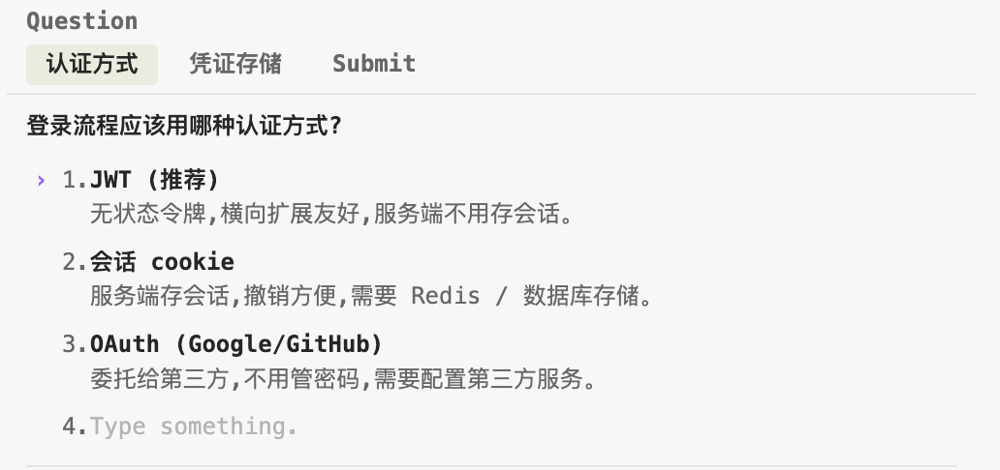

之前研究过 claude code 的设计，用 Java 写了一个乞丐版的 claude code  开源地址 [jooj ](https://github.com/diaozxin007/jooj)。Claude code 的 tools 都设计的非常精巧。所以想逐个研究一下。大家共同学习。

> 本系列先读 [前置篇](../tool-mechanism.md) —— 讲清楚 tool 是什么、Claude 怎么用。本篇是系列第一个具体 tool 的拆解，按前置篇提出的 4 层骨架展开。

## AskUserQuestion

是最常见到的 tools 之一。

### 作用

AskUserQuestion 是 Claude Code 内置的**结构化提问工具**。它不是让 Claude 输出一段问题字符串等用户回复，而是把问题渲染成一个交互式选择面板 —— 用户看到的是一组预设选项（卡片形式），而不是一段纯文字提问。

它解决的核心问题是「AI 与用户之间的高效对齐」：

1. **降低用户负担** —— 从「打字回答」变成「点选项」，响应时间大幅缩短
2. **结构化输入** —— Claude 拿到的是明确的枚举值，不用再解析自然语言
3. **收敛歧义** —— 通过预设选项引导用户在明确的方案之间选择，避免「随便你决定」式的模糊回答
4. **保底逃生舱** —— 系统始终自动附加「其它」选项，允许用户输入自定义文本，避免「选项不合口味只能退出」

### 一个具体例子

在展开触发条件和技术实现之前，先看一个具体场景，感受一下「不用 AskUserQuestion 会怎样 vs 用了会怎样」。

**场景**：用户对 Claude 说 **「帮我给这个应用加个用户登录」**。

这个需求描述得很不完整 —— 用哪种认证方式没定、登录凭证存哪里没定。Claude 既不能瞎猜（用户可能有团队规范），也没法直接从代码里读出来（新功能没先例）。

#### 反例：如果没有 AskUserQuestion

Claude 只能用一段自由文本把问题甩回去，大概长这样：

> 「你想用什么认证方式？我建议 JWT，但也可以用会话 cookie 或 OAuth。另外登录凭证存哪里，httpOnly cookie 还是 localStorage？」

用户会遇到几个问题：

1. **认知负担高** —— 一段长文字里塞了 2 个决策 + 5 个选项，需要用户先解析题目再回答
2. **回答成本高** —— 要么打一段字回复（「JWT + httpOnly」），要么去网上搜「JWT vs 会话 cookie」看两小时再回来
3. **Claude 解析成本高** —— 拿到「就 JWT 吧，cookie 那个」这种回复，还得反推用户到底选了哪个，可能理解错
4. **推荐值淹没在文字里** —— Claude 说「建议 JWT」，但和其它选项混在一起，用户容易忽略
5. **没有兜底** —— 如果用户想用一个 Claude 没提到的方案（比如免密邮件链接），要么另起一段解释，要么被 Claude 的三选一绑架

**核心痛点**：这种纯文本形式，让「协作对齐」变成了一次昂贵的自然语言往返。

#### 用 AskUserQuestion 是怎么解决的

Claude 会构造一个包含 **两个问题** 的调用：

**第一个问题** ——

**第二个问题** ——

用户在界面上看到的是两张卡片，每张卡片顶部是那个短标签（「认证方式」/「凭证存储」），下面是 3 个 / 2 个选项 + 一个自动追加的「其它」。用户点两下选完，Claude 拿到的返回值大致是：

- 第一个问题 → 用户选了 **JWT（推荐）**
- 第二个问题 → 用户选了 **httpOnly cookie（推荐）**

**决策时间从几分钟压到几秒**。这就是 AskUserQuestion 存在的意义 —— 不是「让 AI 问问题」，而是「让协作的每一次澄清都变得低成本」。

#### 对照一下两种形式解决了反例里的哪些痛点

| 反例痛点 | AskUserQuestion 的解法 |
|---|---|
| 认知负担高 | 拆成 2 张独立卡片，一次聚焦一个决策 |
| 回答成本高 | 点选项而不是打字，权衡说明直接标在选项下 |
| Claude 解析成本高 | 返回值是明确的选项文本，不用做自然语言解析 |
| 推荐值淹没在文字里 | 「（推荐）」后缀 + 前置位置，第一眼看到 |
| 没有兜底 | 「其它」自动追加，用户想输入自定义方案永远有出口 |

这个对照本质上就是 AskUserQuestion 每个设计点的存在理由 —— 每一条都对应一个自由文本对话解决不了的痛点。带着这个直觉，再往下看触发条件、技术实现和 prompt 细节，会发现每一条约束都对应到这里的某个具体痛点。

### 触发条件

工具的官方说明里明确写了触发边界：**只有在你被卡住，而这个决策又真正属于用户时才使用**。

三类**该问**的场景：

- **无法从请求推断** —— 需求本身模糊（比如「帮我加个登录」，没说 OAuth 还是 JWT）
- **无法从代码推断** —— 现有代码里没有先例可以模仿
- **没有合理默认值** —— 涉及品味 / 业务规则 / 架构分叉，不该由 AI 拍板

三类**不该问**的场景：

- **答案能从代码里读出来** —— 该花时间读代码，而不是打断用户
- **只有一种明显合理的做法** —— 直接做，提交信息里说明理由即可
- **在计划模式里问「方案 OK 吗」** —— 这是 ExitPlanMode 的职责，用 Ask 是重复

一个典型反模式：**避免「这个方案 OK 吗 / 我可以继续吗」这类元问题**。ExitPlanMode 本身就是「请求批准」，Ask 用来做这个纯属重复。

### 技术实现

#### 1 · 命名

`AskUserQuestion`

#### 2 · 工具级描述

AskUserQuestion 的描述围绕三件事：**什么时候用 / 什么时候不用 / 和邻居的分工**。

**开篇第一句 · 严格的适用边界**

> Use this tool only when you are blocked on a decision that is genuinely the user's to make: one you cannot resolve from the request, the code, or sensible defaults.

这句在训练 Claude「不要主动打扰」—— 遇到不确定，第一反应应该是**先查代码、先用合理默认值**，而不是甩问题给用户。「blocked」+「genuinely the user's」是两个高门槛词，不满足其一就不该用这个工具。

**「其它」逃生舱的透明化**

> Users will always be able to select "Other" to provide custom text input

系统不是把这个选项藏起来让 Claude 假装不知道 —— 而是**明确告诉 Claude「其它会自动加，你不用列」**。这样 Claude 不会浪费一个选项去手写「自定义」。

**与计划模式的时序关系**

> Plan mode note: To switch into plan mode, use EnterPlanMode (not this tool). Once in plan mode, use this tool to clarify requirements or choose between approaches BEFORE finalizing your plan. Do NOT use this tool to ask "Is my plan ready?", "Should I proceed?", or otherwise reference "the plan" in questions — the user cannot see the plan until you call ExitPlanMode for approval.

这段是最有教学价值的 —— 明确了整套流程的**时序**：

1. 计划模式里，先用 Ask 澄清方案分叉（如「选 A 还是 B」）
2. 澄清完后，用 EnterPlanMode 落一份完整方案
3. **最后一步**用 ExitPlanMode 请求批准 —— **不要**再用 Ask 问「OK 吗」

原文最后半句 —— 「用户在你调用 ExitPlanMode 之前根本看不到方案」—— 这才是「不要在计划模式里问『方案 OK 吗』」的**真正原因**：不是重复，而是**用户根本没东西可批**。

工具级描述里塞这段的价值：**Claude 每次考虑用 AskUserQuestion 时都会读到"和 plan mode 的关系"** —— 把工具间的协作契约写进单个工具的描述里，而不是指望模型自己去比对多个工具。

#### 3 · 字段级描述

AskUserQuestion 的字段描述有一个共同套路：**约束 + example**。example 塞在 description 结尾，等于每个字段都自带一份 few-shot。

**`question` 字段的描述**

> The complete question to ask the user. Should be clear, specific, and end with a question mark. Example: "Which library should we use for date formatting?"

关键在最后一句 **Example** —— 这是塞在 schema 里的 **few-shot**。技术上你写陈述句也能通过校验，但示例告诉模型"标准问题长这样"。「必须以问号结尾」是靠这个 example 训练进 Claude 的语感，而不是靠正则拦截。

**`header` 字段的描述**

> Very short label displayed as a chip/tag (max 12 chars). Examples: "Auth method", "Library", "Approach".

三个 example 全是**英文 1-2 词的名词短语**。这在告诉 Claude：这里不是问句的浓缩，是**主题名词**。看 example 就知道该写「认证方式」而不是「用哪种认证」。

**`label` 字段的描述**

> The display text for this option that the user will see and select. Should be concise (1-5 words) and clearly describe the choice.

字符数约束通过描述（1-5 words）传达，而不是 maxLength —— 因为"词"和"字符"在多语言下不一致。这是**用描述而非硬约束更合适**的场景。

**推荐值的表达形式**

> If you recommend a specific option, make that the first option in the list and add "(Recommended)" at the end of the label

一个反事实设计：如果 Option 里加一个 `isRecommended: boolean` 字段，Claude 可以把倾向藏在元数据里、渲染时才凸显。当前设计不这么做，要求写进 label 文本本身（首位 + `(Recommended)` 后缀）。

区别在于：**元数据可以"不表态但暗中偏向"**，写进用户可见文本 Claude 必须承担明确立场。schema 把"AI 该不该表态"这个软性问题变成了"要表态就写进 label"的硬性选择 —— 这条**不是 schema 校验，是 description 里的行为规约**。

#### 4 · schema 校验规则

前三层都是自然语言劝导，这一层是**硬拦截**。AskUserQuestion 用了几处关键数字：

| 约束 | 值 | 意图 |
|---|---|---|
| `questions` 数量 | 1~4 | 挡住"连问"，逼 Claude 批量收敛决策 |
| `options` 数量 | 2~4 | 下限拒绝"单选装样子"，上限拒绝"长清单甩锅" |
| `header` 长度 | ≤ 12 字符 | 强迫概念浓缩成主题名词 |
| `multiSelect` 默认 | false | 单选是最佳实践默认，多选要显式声明 |

关键在于：**这些数字写超了 tool call 直接被 schema 挡住**，模型物理上写不出来。前面 2 / 3 层里写的所有"应该"，这一层用类型系统再兜一次底 —— 二者冲突时，schema 是最后一道防线。

举个例子：工具级描述说"逼 Claude 做归类不要列长清单"，字段级描述里 label 说"concise 1-5 words"，校验规则用 `maxItems: 4` 兜底。三层递进：宏观意图 → 字段级 hint → 硬拦截。

---

**与 EnterPlanMode / ExitPlanMode 的分工**：

- 计划模式里，用 AskUserQuestion 澄清「选哪种方案」（在方案定稿之前）
- 计划模式里，不要用 AskUserQuestion 问「我的方案 OK 吗」（用 ExitPlanMode）
- 非计划模式里，用 AskUserQuestion 处理任何需要用户拍板的技术分叉

三个工具串起来是一条完整的决策流水线：**Ask 澄清 → EnterPlanMode 展开 → ExitPlanMode 拍板**。

---

**总结**：AskUserQuestion 的精妙之处，不在于它「让 AI 问用户问题」这个功能本身，而在于它把 4 层设计手段用满 —— 命名传隐式语义、工具级描述限定使用边界、字段级描述塞 few-shot、schema 硬约束物理拦截误用。相当于把「AI 提问」这个泛用能力，收敛成一个可预测、可组合、可维护的交互原语。

下一篇继续拆 **[EnterPlanMode](enter-plan-mode.md)** —— 三工具决策流水线的第二环 · 一个空参数的工具是怎么设计的。
